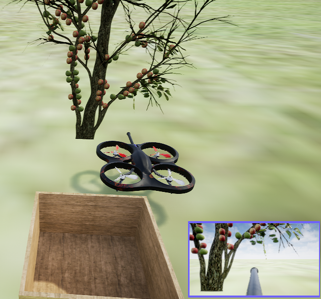

<p align="center">
  
</p>

# Dronapple - A Model for apple picking using machine learning and drones

This model was created as a Final paper (TCC) of the Computer Science course at the University of Vale do Rio dos Sinos (Unisinos).

The paper will be available soon...

A video of the Dronapple model running in the simulator is available [here](https://youtu.be/YIr9OHIYEUc) - More information is in the video's description.

This repository has the code to train and validate the proposed Dronapple model.

If you do not change the code and environments, this repository is ready to run the final Dronapple model with the networks trained for the paper (just do what the "Prerequisites" section asks, and then run environment2 and "main.py" file). It is worth remembering that in the paper, the computer was able to run the Dronapple model at ~5.74 FPS, and running at different FPS can change the results.

PS: None of the data used to train the networks is available because there is a lot of it and that can be easily created by following the sections below. But all the analysis results are available in Jupyter Notebooks in the paths: "data/env1" and "data/env2".

## Prerequisites

The environments to simulate the drone and the apples were created using the Unreal Engine and the Airsim plugin, which is available at the following link: [Dronapple - Unreal](https://drive.google.com/file/d/1vEzPdyaFIjD5-iJSfht0PSRUilWma0C1/view?usp=sharing).

All libraries used to train and validate the models are available in the "drone.yml" file that can be installed using Anaconda. Due to incompatibility, must install two libraries after installing the environment using yml:

```
conda activate drone
pip install msgpack-rpc-python==0.4.1
pip install airsim==1.7.0
```

Due to incompatibility between Airsim and Jupyter notebook, another environment has been created to run Jupyter Notebook files and is available in the "jupyter.yml" file.

## Running

To run the simulator environment, Unreal Engine v4.25.4 must open the "MyDrone.uproject" file and, if requested, recompile the Airsim plugin. All created environments are available in the "Content" folder as "Environment1" and "Environment2". To start the environment, press "start" and in the popup that appears, press "No" to start with the drone.
 
There are two main files that can be run:
    
* "control_keyboard.py" file, available in the root folder. Allow controlling the drone using the keyboard and taking pictures using the drone camera (these images were used to train object detector);
* "main.py" file, available in the root folder. Used to execute all training and validate in the simulator, according to the code typed in the "what_to_run" variable.

## How to train all models

All components of the Dronapple model are available in the "components" folder and were trained using the environment1 (expect the object detector that was trained one for each environment), detailed below:

### component1_and_4

There is no model that can be trained, as all actions are done using logical conditions.

### component2

To train the object detector, it is possible to use the "control_keyboard.py" file to take pictures of the environment. Yolov7 was used in this project and the training code is not available in this repository but can be found [here](https://github.com/WongKinYiu/yolov7).

The tracking system does not have a model that can be trained, as all actions are done using logical conditions.

PS: The trained object detector (network) must be pasted in the following path: "components/component2/yolov7/models"

### component3

It is available to train the agent to move the drone to the apple in the "main.py" file. To do this, set the "what_to_run" variable to one of the below numbers:
 - Number 1: To create manual system data (move the drone using logical conditions and environment information). In this project, these data were used as a pretraining for the main agent;
 - Number 2: To train using the default network with PPO and DDPG policies;
 - Number 3: To train using a custom network architecture with PPO policy.

To train the suction system, set the "what_to_run" variable to 5 to collect data from the environment (the agent that will be run must be in the path "components/component3/agent") which will be stored in the following path: "data/env1/Comp3_suction". After collecting the data, it is possible to train the network using the Jupyter Notebook "train_and_analysis_network_suction.ipynb".

PS¹: The trained agent must be pasted in the following path: "components/component3/agent"

PS²: The trained suction must be pasted in the following path: "components/component3/suction/model"

## How to validate all models

Below are detailed how to validate the components and the Dronapple model (all components together):

### Environment1

To run and collect data of all systems, the numbers below must be set in the "what_to_run" variable to run on environment1:
 - Number 22: Validate all results of PPO and DDPG policies
 - Number 33: Validate all results of custom networks architectures
 - Number 4: Validate the tracking system
 - Number 55: Validate the suction system

After collecting the data, the Jupyter Notebooks in the path "data/env1" can be used to analyze the results.

### Environment2 (all components together)

To run the Dronapple model, must be set the "what_to_run" variable to 6 and the Jupyter Notebook in the path "data/env2" can be used to analyze the results.

## Authors

* **Maxwell F. Barbosa** - [MaxwellFB](https://github.com/MaxwellFB)
    * Oriented by [Jorge Luis Victória Barbosa](http://lattes.cnpq.br/6754464380129137)...

## License

This project is licensed under the MIT License - see the [LICENSE.md](LICENSE.md) file for details
